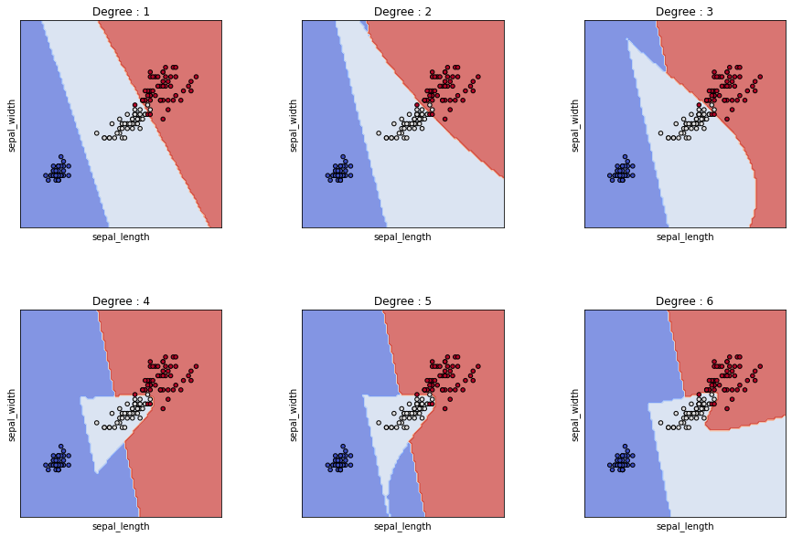
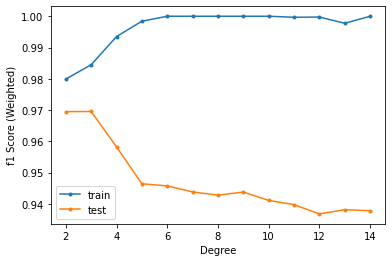
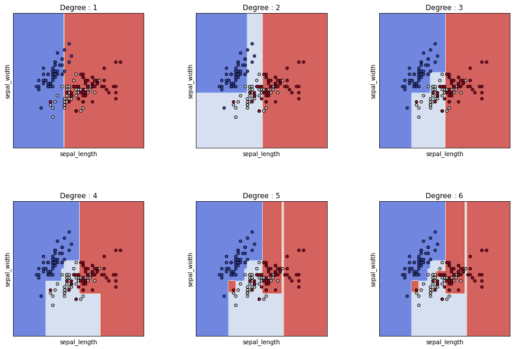
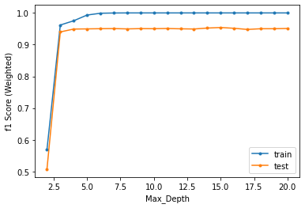
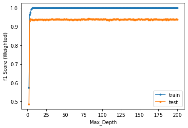

# Structural Risk
> “When faced with two equally good hypotheses, always choose the simpler”

<p align="center">
    
</p>

머신러닝을 처음 배우기 시작했을 때부터 항상 강조되던 말, **"모델을 너무 복잡하게 만들면 일반화에 어렵다"** \
나 또한 그랬고, 대부분의 사람들이 이 말에 고개를 끄덕일 것이라고 생각한다.

최근 deep learning 분야에서도 일반화에 대한 의문이 계속 나오고 있긴 하지만 *(Zhang, Chiyuan, et al. "Understanding deep learning (still) requires rethinking generalization." Communications of the ACM 64.3 (2021): 107-115.)* 워낙 좋은 성능을 보이고 있기 때문에 더이상 모델 복잡도가 올라간다고 해서 일반화가 안된다고 단순하게 말하기는 어려울 것으로 보인다. 따라서 이번 기회에 직접 결과를 산출해보며 그동안 알고, 믿고 있었던 모델 복잡도와 모델 일반화 간의 관계가 아래 그래프와 같은 결과가 나올지 확인해보고자 한다.

<p align="center">
    
</p>


## Table of contents

- [Data](#1_Data)
- [SVC](#2_SVM)
- [Decision Tree](#3_Decision-Tree)

# 1_Data
이번에는 sklearn data에서 가장 대표적인 데이터 중 하나인 **Iris 데이터**를 가지고 테스트를 진행해보고자 한다.
```Python
irisdata = pd.read_csv('iris.csv')
sns.pairplot(irisdata,hue='class',palette='Dark2')
```
<p align="center">
    
</p>

```Python
X = irisdata.drop('class', axis=1)  
y = irisdata['class']  
X_train, X_test, y_train, y_test = train_test_split(X, y, test_size = 0.20, shuffle=True)
```
간단하게 train_test_split 함수를 통해 train셋과 test셋을 준비한다. 

# 2_SVM

sklearn 패키지는 다양한 서포트 벡터 머신(SVM) 모듈을 제공하는데, 그 중 **SVC(C-Support Vector Classification)** 을 사용하고자 한다.
SVC 모듈에서 모델의 복잡도를 늘릴 수 있는 변수는 degree로, 이는 polynomial kernel function의 degree를 의미한다.
따라서 자동적으로 우리는 polynomial kernel을 사용할 계획이다.

**Degree를 늘리는 것이 모델의 복잡도를 증가시킨다고 할 수 있을까?** \
Iris 데이터 중 sepal_length와 sepal_width만 추출하여 2D로 나타내었을 때 degree가 변함에 따라 decisionboundary가 어떻게 변하는지 살펴보았다. 낮은 degree에서는 거의 선형적으로만 구분 되던 boundary가 degree가 증가함에 따라 더 복잡한 형상을 띄게 되는 것을 통해 이 두 변수 사이에 상관관계가 있음을 확인할 수 있었다.

<p align="center">
    
</p>

```Python
X = np.array(irisdata.drop('class', axis=1))[:, 2:4]
y = irisdata['class']  
iris = datasets.load_iris()


fig, sub = plt.subplots(2, 3, figsize=(15, 10))
plt.subplots_adjust(wspace=0.4, hspace=0.4)
X0, X1 = X[:, 0], X[:, 1]

for degree,ax in zip(range(1,7), sub.flatten()):
    classifier = SVC(kernel='poly', degree=degree, gamma="auto")
    classifier.fit(X, y)
    
    disp = DecisionBoundaryDisplay.from_estimator(
        classifier,
        X,
        response_method="predict",
        cmap=plt.cm.coolwarm,
        alpha=0.7,
        ax=ax,
        xlabel=irisdata.columns[0],
        ylabel=irisdata.columns[1],
    )    
    ax.scatter(X0, X1, c=iris.target, cmap=plt.cm.coolwarm, s=20, edgecolors="k")
    ax.set_xticks(())
    ax.set_yticks(())
    ax.set_title(f'Degree : {degree}')
plt.show()

```

**Degree 변화에 따른 Train/Test Score 변화**
```
X = irisdata.drop('class', axis=1)  
y = irisdata['class']  
result = dict()
for _ in range(100):
    X_train, X_test, y_train, y_test = train_test_split(X, y, test_size = 0.20, shuffle=True)
    
    for i in range(2,15):
        if i not in result:
            result[i] = {'train':[], 'test':[]}
            
        classifier = SVC(kernel='poly', degree=i, gamma="auto")
        classifier.fit(X_train, y_train)

        y_train_pred = classifier.predict(X_train)
        y_pred = classifier.predict(X_test) 
        
        result[i]['train'].append(f1_score(y_train, y_train_pred, average="weighted"))
        result[i]['test'].append(f1_score(y_test, y_pred, average="weighted"))

```

<p align="center">
    
</p>
```

앞서 언급한 것처럼 SVC의 degree에 2부터 15까지 변화를 주면서 training score와 test score를 각각 비교해보았다.
Label이 3개인 경우이므로 score는 Weighted f1_score를 적용했으며, train_test_split시 랜덤하게 데이터를 나누기 때문에 같은 실험을 100번 반복하여 평균값을 비교하도록 했다.

그 결과 training score는 degree가 6일 때부터 1로 수렴한 후 비슷한 값을 유지하는 반면, test score는 degree:3에서 0.9695를 고점으로 그 이후로 하향세를 보였다.
중간중간 (ex. test : 9, train : 13)에 이러한 경향을 보이지 않는 지점들이 있긴 하지만, 그 변화가 매우 미비해 유의미하다고 보기엔 어려울 것으로 보인다.


# 3_Decision-Tree
```
X = irisdata.drop('class', axis=1)  
y = irisdata['class']  
result = dict()
for _ in range(100):
    X_train, X_test, y_train, y_test = train_test_split(X, y, test_size = 0.20, shuffle=True)
    
    for i in range(1,20):
        if i not in result:
            result[i] = {'train':[], 'test':[]}
            
        classifier = DecisionTreeClassifier(max_depth=i)
        classifier.fit(X_train, y_train)

        y_train_pred = classifier.predict(X_train)
        y_pred = classifier.predict(X_test) 
        
        result[i]['train'].append(f1_score(y_train, y_train_pred, average="weighted"))
        result[i]['test'].append(f1_score(y_test, y_pred, average="weighted"))
```
Decision Tree도 SVM과 마찬가지로 조작이 가능한 변수 중 max_depth를 변경하면서 모델의 성능을 관찰하고자 한다. Max_depth는 boundary 개수에 상한선을 부여하기 때문에 모델 복잡도에 영향을 끼치는 변수라고 생각했다. 그래도 Max_depth와 모델 복잡도의 연관성을 살펴보기 위해 SVM과 마찬가지로 sepal_length와 sepal_width만 추출하여 2D로 Decision Boundary를 나타내보았다.
<p align="center">
    
</p>
당연하게도 max_depth가 증가함에 따라 training set 데이터들을 더 세세하게 나누면서 모델의 복잡도가 증가하는 것을 확인할 수 있었다.


**Max_Depth 변화에 따른 Train/Test Score 변화**

위 Max_depth 변화에 따른 Decision Boundary를 살펴보았을 때 max_depth를 증가시키면 증가시킬수록 더 촘촘하게 boundary를 생성하다보니 test_score는 당연히 내려갈 것이라고 생각했다.

<p align="center">
    
</p>
<p align="center">
    
</p>

하지만 결과는 예상과 달랐는데, 물론 max_depth=7부터 score가 1로 수렴하는 training set보다 score는 낮지만, max_depth를 계속 증가시켜도 0.95 정도의 test score를 유지하는 모습을 보였다. 심지어 data 개수보다 많도록 max_depth를 200까지 증가시켜봐도 test score는 떨어지지 않았다.

당연히 test score가 떨어질 것으로 생각했었으나 결과를 확인한 후 생각해보니, 다음과 같은 이유로 이런 결과가 나올 수 있겠다는 생각이 들었다.

1. max_depth는 depth의 최대값을 설정할 뿐, 실제 depth가 해당 값이 될 필요는 없다
2. Iris data의 분포가 비교적 간단하여, 낮은 값의 depth로도 충분히 분류가 가능하다

하지만 설령 상기 이유 때문에 test score가 떨어지지 않았다고 해도, train score가 상승하는 max_depth : 1~7 구간에서 test score가 감소하는 구간이 나와야 할 것으로 생각하는데, 추가적인 고찰이 필요해보인다.


---
###### https://www.google.com/url?sa=i&url=https%3A%2F%2Farthagyaipcw.wordpress.com%2F2022%2F02%2F01%2Foccams-razor%2F&psig=AOvVaw2YW8fIQW8LvY6cvBw8_IlN&ust=1666872127537000&source=images&cd=vfe&ved=0CA4QjhxqFwoTCJj54drs_foCFQAAAAAdAAAAABAD

###### https://www.google.com/url?sa=i&url=https%3A%2F%2Fvitalflux.com%2Foverfitting-underfitting-concepts-interview-questions%2F&psig=AOvVaw11hm2GW-F2FQBtVJL-TsfS&ust=1666872151275000&source=images&cd=vfe&ved=0CA4QjhxqFwoTCKizmOfs_foCFQAAAAAdAAAAABAD

###### https://scikit-learn.org/stable/modules/generated/sklearn.svm.SVC.html#sklearn.svm.SVC

###### https://scikit-learn.org/stable/modules/generated/sklearn.tree.DecisionTreeClassifier.html

