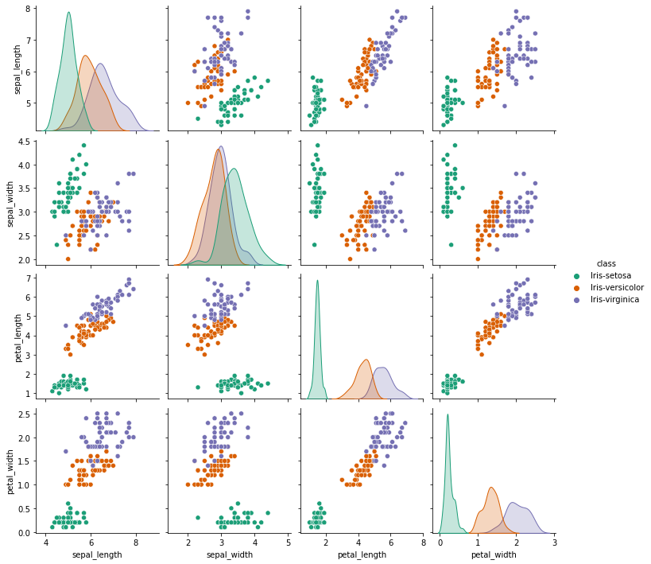

# Structural Risk
> “When faced with two equally good hypotheses, always choose the simpler”

<p align="center">
    
</p>

머신러닝을 처음 배우기 시작했을 때부터 항상 강조되던 말, **"모델을 너무 복잡하게 만들면 일반화에 어렵다"** \
나 또한 그랬고, 대부분의 사람들이 이 말에 고개를 끄덕일 것이라고 생각한다.

최근 deep learning 분야에서도 일반화에 대한 의문이 계속 나오고 있긴 하지만 *(Zhang, Chiyuan, et al. "Understanding deep learning (still) requires rethinking generalization." Communications of the ACM 64.3 (2021): 107-115.)* 워낙 좋은 성능을 보이고 있기 때문에 더이상 모델 복잡도가 올라간다고 해서 일반화가 안된다고 단순하게 말하기는 어려울 것으로 보인다. 따라서 이번 기회에 직접 결과를 산출해보며 그동안 알고, 믿고 있었던 모델 복잡도와 모델 일반화 간의 관계가 아래 그래프와 같은 결과가 나올지 확인해보고자 한다.

<p align="center">
    
</p>


### Table of contents

- [Overview](###1_Data)
- [SVC](#SVC)
- [Decision Tree](#Decision-Tree)
- [A](#Decision-Tree)

### 1_Data
이번에는 sklearn data에서 가장 대표적인 데이터 중 하나인 Iris 데이터를 가지고 테스트를 진행해보고자 한다.
```Python
irisdata = pd.read_csv('iris.csv')
sns.pairplot(irisdata,hue='class',palette='Dark2')
```
<p align="center">
    
</p>

```Python
X = irisdata.drop('class', axis=1)  
y = irisdata['class']  
X_train, X_test, y_train, y_test = train_test_split(X, y, test_size = 0.20, shuffle=True)
```
간단하게 train_test_split 함수를 통해 train셋과 test셋을 준비한다. 

