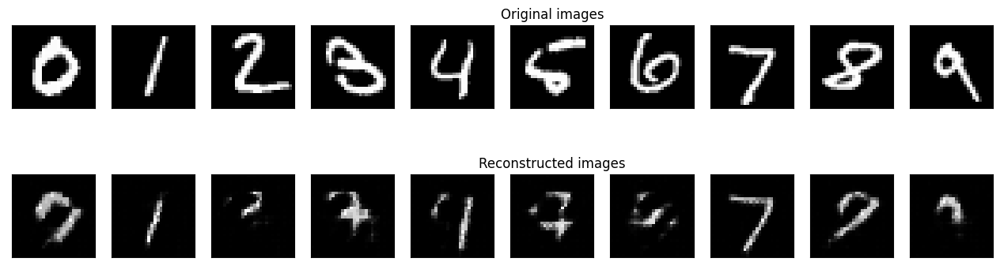
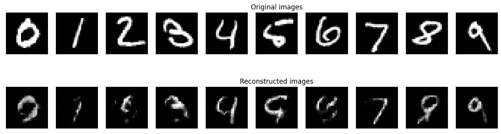

# Autoencoder

<p align="center">
    
</p>

그동안 이미지 관련 문제에서 Anomaly Detection이 필요할 때마다 많이 써왔던 Autoencoder인데,\
이번 수업을 계기로 그동안 가져왔던 의문점을 풀어보면 좋겠다는 생각에 이번 튜토리얼 주제로 결정했다. 


# 1_Dataset
우선 데이터는 특성이 명확하면서 다루기 쉬운 MNIST 데이터로 결정했다. 

```Python
from torchvision.datasets import MNIST
mnist_transform = transforms.Compose([
    transforms.ToTensor(), 
    transforms.Normalize((0.5,), (1.0,))
])
download_root = './MNIST_DATASET'
train_dataset = MNIST(download_root, transform=mnist_transform, train=True, download=True)
test_dataset = MNIST(download_root, transform=mnist_transform, train=False, download=True)
```
위의 코드를 사용하면 웹상에서 torch dataset 형태로 손쉽게 데이터셋을 불러올 수 있다.

```Python
batch_size = 128 
train_loader = DataLoader(dataset=train_dataset, batch_size=batch_size, shuffle=True)
test_loader = DataLoader(dataset=test_dataset, batch_size=batch_size, shuffle=False)
```
torch에서 제공하는 DataLoader를 사용하면 batch_size, transform, shuffle, multi-gpu 등 다양한 조건들을 손쉽게 세팅할 수 있기 때문에 모델 학습시 즐겨 사용한다.

# 2_Latent Dimension

많은 textbook이나 reference에서 상응하는 결과를 보여왔으므로
naive한 생각으로 당연히 latent dimension이 증가할수록 output되는 결과가 더 좋아질 것으로 보인다.
그런데 내가 궁금한 점은, 우리는 latent feature 안에 노이즈 및 불필요한 정보가 제외된, 중요한 정보만이 남겨있다는 기대(?)를 하고 있는데,
과연 육안으로 우리가 그 것을 확인할 수 있을까 하는 것이다. \
따라서 Latent Dimension을 중가시키면서 output 되는 이미지들을 확인해보고자 했다.

```Python
num_epochs = 50
for dim in range(1,11):
   train_dataset, test_dataset, train_loader, test_loader = create_dataset()
   loss_fn, model, optim = init_model(latent_dim = dim)
   min_loss = np.inf
   diz_loss = {'train_loss':[],'val_loss':[]}
   for epoch in range(num_epochs):
      train_loss = train_epoch(model,device,train_loader,loss_fn,optim)
      val_loss = test_epoch(model,device,test_loader,loss_fn)
      
      if val_loss < min_loss :
         opt_model = model
         best_epoch = epoch
      diz_loss['train_loss'].append(train_loss)
      diz_loss['val_loss'].append(val_loss)
   print(f"epoch : {best_epoch}, Val_loss : {np.min(diz_loss['val_loss'])}")
   save_dict = {
      "model" : opt_model.state_dict(),
      "loss" : diz_loss
   }
   torch.save(save_dict, f'model/number_{number}')
   plot_ae_outputs(opt_model,test_dataset,n=10,name='unpooling', num=dim)
```
<hr/>
<p align="center">
    
</p>
latent_dim : 1
<hr/>
<p align="center">
    
</p>
latent_dim : 2
<hr/>
<p align="center">
    
</p>
latent_dim : 5
<hr/>
<p align="center">
    
</p>
latent_dim : 10
<hr/>

예상했던 것과 같이 dimension이 증가함에 따라 결과가 나아짐을 정성적으로 파악할 수 있었는데,
흥미로운 점은 dimension이 극도로 작을 때(dim : 0 or 1) 나타난다.
다른 숫자의 경우 어떤 숫자인지 구별이 어려울 정도의 결과를 보이는 반면, 숫자 0과 1은 비교적 또렷하게 숫자를 구분할 수 있었다.
숫자 1의 경우 간단하면서 다른 숫자들도 갖고 있는 형태를 띄기 때문에 그런 것으로 설명이 가능하나, 숫자 0 또한 결과가 잘 나오는 것은 이해하기 어려웠다. 혹시 데이터셋에서 0과 1의 비중이 높아서 발생하는 현상인지 확인하기 위해

```Python
train_dataset = MNIST(download_root, transform=mnist_transform, train=True, download=True)
for number in range(10):
    targets = train_dataset.targets.numpy()
    t_idx = np.where(targets==number)[0]
    print(f'len({number}) : {len(t_idx)}')
```
숫자별 학습 데이터 수를 확인해봤으나 
```
len(0) : 5923
len(1) : 6742
len(2) : 5958
len(3) : 6131
len(4) : 5842
len(5) : 5421
len(6) : 5918
len(7) : 6265
len(8) : 5851
len(9) : 5949
```
숫자 0의 개수는 오히려 적은 편에 속하여, 그런 이유는 아닌 것으로 보인다. 

**그렇다면 0과 1은 왜 극도로 작은 dimension으로도 잘 구분이 되었던 것일까?** 

다음으로 드는 생각은 0과 1의 특성이 매우 달라서 작은 dimension의 latent space로도 충분히 구별이 가능하다는 생각이었다.
이를 확인하기 위해 latent_dim을 2로 설정한 후 해당 latent space를 2차원 상에 나타내보았다. 

<p align="center">
    
</p>

예상대로 숫자 0과 1은 latent_dim = 2인 경우에도 두 그룹은 명확하게 구분되는 것을 확인할 수 있었다.

더 정확한 비교를 위해 다른 숫자를 포함하여 그래프를 그려본 결과,

<p align="center">
    
</p>
<p align="center">
    
</p>

숫자 2는 1과, 6은 0과 비슷한 양상을 보이면서 해당 latent dimension으로는 구분이 어려운 것을 확인할 수 있었다.
이를 통해 해당 Autoencoder의 경우 원모양의 feature와 직선 모양의 feature를 2차원의 feature_space에 담아내고 있었으며,
중요한 특정 feature만을 남긴다는 Autoencoder의 이론을 확인할 수 있었다. 

추가적으로, 전체 숫자로 학습을 시켰을 경우 직선과 원 모양의 feature를 먼저 찾아낸다는 것을 확인하였으니, 
한 가지의 숫자로 학습을 진행한 경우에는 어떤 feature들이 뽑아내지며, 이는 다른 숫자를 reconstruct 할 때 어떻게 발현되는지 확인해보고자 한다. 

<hr/>
<p align="center">
    
</p>
Model trained with '0'


<hr/>
<p align="center">
    
</p>
Model trained with '1'


<hr/>
<p align="center">
    
</p>
Model trained with '2'


<hr/>
<p align="center">
    
</p>
Model trained with '3'


<hr/>
<p align="center">
    
</p>
Model trained with '7'


<hr/>
<p align="center">
    
</p>
Model trained with '9'

위의 결과를 통해 확실히 Autoencoder가 특정 feature를 추출해내고 있다는 것을 확인할 수 있었다. 0만으로 학습시켰을 때는 원모양의 feature 중심으로 reconstruction을 진행하는 모습을 볼 수 있었으며, 반대로 1의 경우 직선 위주로 reconstruct 하는 것을 볼 수 있었다. 비슷한 예시로 3으로 학습한 경우 2의 둥근 부분, 7의 경우 꺾인 선의 형상, 9의 경우 0과 8에서 나타나는 원의 모습을 잘 복원하는 것을 볼 수 있었다. 


# 3_Up_pooling 기법
Autoencoder는 당연하지만 차원을 축소하는 Encoder 부분과 차원을 확장하는 Decoder 부분으로 나뉜다. Encoding 부분은 보통 CNN 레이어의 stride값이나, Pooling 레이어를 통해 차원을 축소하는 방법을 주로 사용한다. 그동안 Autoencoder를 사용하면 Decoder 부분에서 Upsampling + CNN 방식을 사용해왔는데, 이번 강의 시간에 ConvTranspose 기법에 대한 이야기가 나와서 관련 내용을 살펴보았다. 
*https://distill.pub/2016/deconv-checkerboard/* 에 따르면 ConvTranspose는 overlap 되는 부분에서 checkerboard와 같은 현상이 일어나며, 때문에 resize + convolution 기법을 사용하는 것을 장려한다고 명시되어 있다. 나 또한 resize + convolution 기법만을 사용해왔으나, 'ConvTranspose 기법보다 당연히 낫겠지'라고 생각하면서 계속 사용하는 것은 이번 강의 취지에 맞지 않다고 생각하여, 이 두 기법을 비교해보기로 했다. 


<p align="center">
    
</p>

ConvTranspose Layer를 사용하여 학습을 진행할 경우, 앞서 언급된 것처럼 checkerboard와 비슷한 패턴이 나타났음을 확인할 수 있었다.
하지만 이와 같은 패턴은 학습이 진행됨에 따라 사라졌고, latent_dim:16일 경우 최종 결과는 아래와 같았다.

<p align="center">
    
</p>

이를 아래 resize + convolution 결과와 비교해봤을 때,

<p align="center">
    
</p>

오히려 ConvTranspose를 사용했을 때 정성적으로 더 좋은 결과를 보이는 것으로 보인다. 
```
print(np.min(torch.load(f'model/Convtranspose_0')['loss']['val_loss']))
0.21219929
print(np.min(torch.load(f'model/Upsample_0')['loss']['val_loss']))
0.21273543
```
정량적으로도 Convtranspose 모델이 약간 더 좋은 성능을 보이는 것을 확인할 수 있었다. 

극단적인 차이는 latent_dim:2로 설정했을 때 나타났는데, 
<p align="center">
    
</p>
<p align="center">
    
</p>
숫자 3과 6에서 transpose_2가 관련 특징을 더 잘 추출해낸 것을 알 수 있었다. 비록 이미지 처리 방식에서 checkerboard와 같은 문제가 발생할 수 있다고 하나, feature를 추출하는 데에 있어서는 ConvTranspose layer를 사용하는 것이 더 적절하지 않나 생각한다. 


